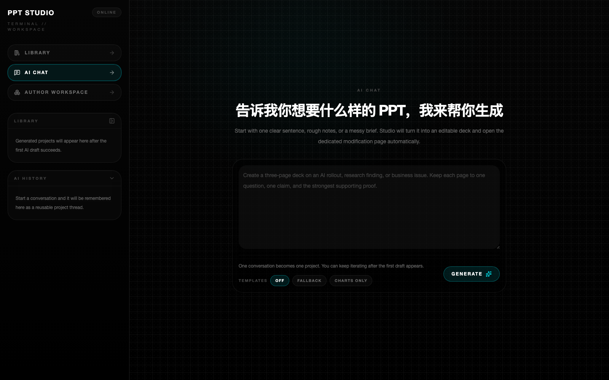
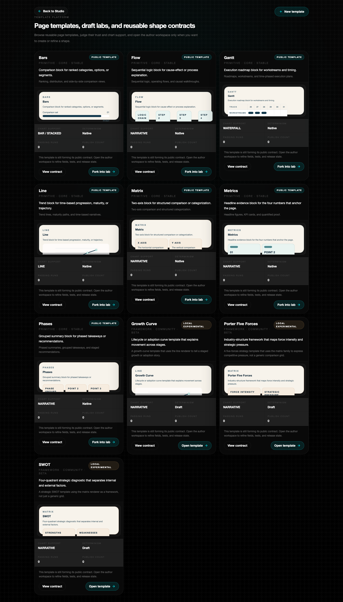
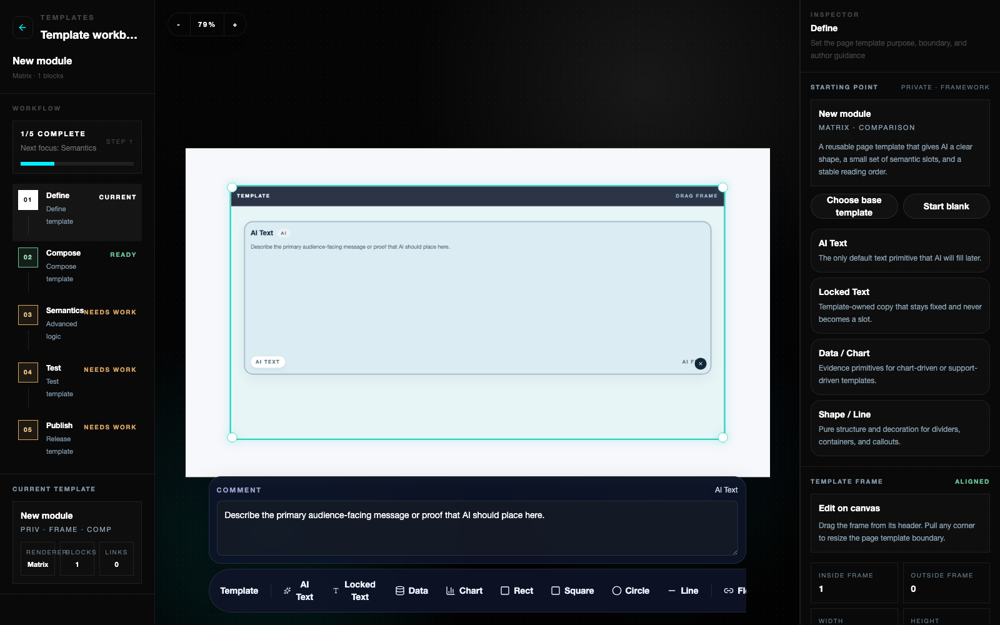
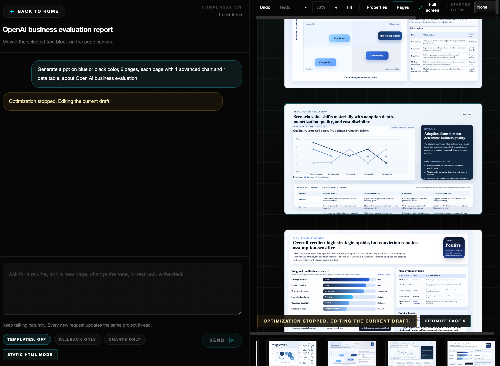
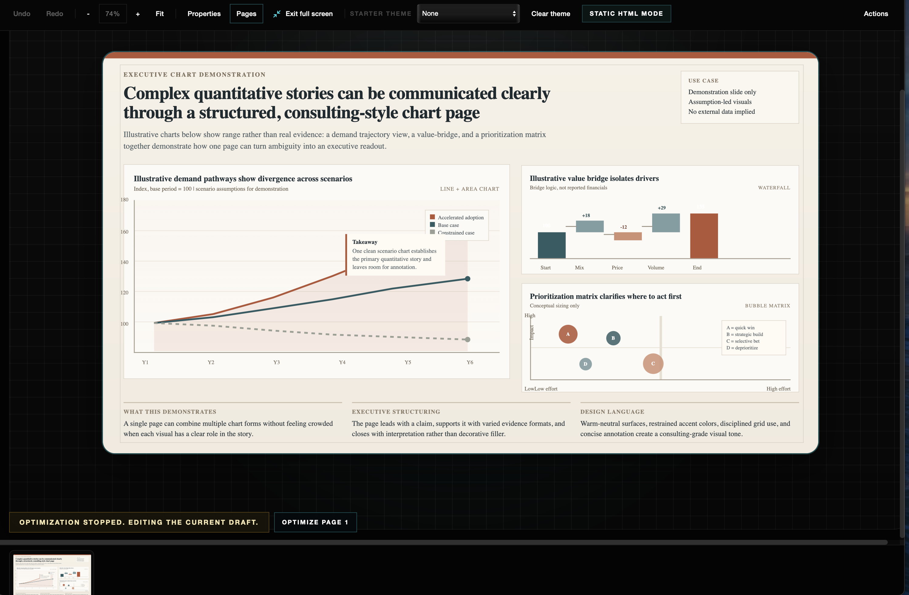

# Claw Design

I’m open-sourcing this in alpha.

It already works, but it is still rough in places. Studio is a local-first AI presentation workbench for generating, refining, and authoring 16:9 HTML slide decks, and I’d really appreciate issues or feedback if you try it and hit something confusing.

Studio combines three workflows in one repo:

- AI-first deck generation from a natural-language brief
- A template workbench for building reusable page shape contracts
- A review and repair loop for fit, title quality, density, and export readiness

## Screenshots





## Demo




<video src="https://github.com/Mijiang111/claw-design/raw/codex/animated-preview-manifest/docs/assets/videos/video1.mov" controls width="100%"></video>

<video src="https://github.com/Mijiang111/claw-design/raw/codex/animated-preview-manifest/docs/assets/videos/video2.mov" controls width="100%"></video>

## What It Does

- Generates slide-like HTML reports from a raw brief
- Keeps output on a fixed 1600x900 canvas for PPT-style composition
- Supports template-authoring with explicit AI text slots, charts, and decorative geometry
- Reviews generated pages for layout fit, title leaks, density, and repair opportunities
- Exports publishable HTML and editable `.pptx`

## Current Status

This repository is an `alpha`.

- It is `local-first`: workspace state is stored in the browser
- It expects access to a local AI agent command for generation
- It is optimized for experimentation, authoring, and prompt/runtime iteration, not multi-user cloud deployment
- It still has rough edges in setup, generation quality, and template authoring UX

## Quick Start

### Requirements

- Node.js `20+`
- `pnpm` `9+`
- A local Codex-compatible command or authenticated local agent environment

### Install

```bash
pnpm install
```

### Configure

Copy the example env file if you want to customize ports or the local agent command:

```bash
cp .env.example .env
```

Key defaults:

- Server: `http://127.0.0.1:3101`
- UI: `http://127.0.0.1:5174`
- API base from the UI defaults to `/api`
- If your local AI agent is not configured, generation and revision flows will not fully work yet

### Run

```bash
pnpm dev
```

Then open:

- UI: [http://127.0.0.1:5174](http://127.0.0.1:5174)
- Health check: [http://127.0.0.1:3101/api/health](http://127.0.0.1:3101/api/health)

## Repo Layout

- [`ui/`](ui/) React + Vite workbench UI
- [`server/`](server/) Express server and Studio generation engine
- [`tests/`](tests/) stability and workspace evaluation harnesses
- [`scripts/`](scripts/) local dev orchestration

## Architecture

The app is split into four main layers:

1. `UI`: Studio runtime, template workbench, and export surfaces
2. `Server`: request validation, streaming APIs, prompt/workspace assembly, repair flow
3. `Local AI agent`: invoked by the server for generation and revision
4. `Local persistence`: browser IndexedDB and local storage for workspaces and projects

## API

Current server endpoints:

- `GET /api/health`
- `POST /api/studio/generate-html`
- `POST /api/studio/generate-html/stream`
- `POST /api/studio/revise-html/stream`

## Development Commands

```bash
pnpm dev
pnpm build
pnpm typecheck
pnpm test:stability:quick
pnpm test:stability:full
pnpm test:workspace:eval
```

## Known Limitations

- Generation quality depends on your local AI agent setup and model access
- The current product is built for single-machine use, not shared cloud workspaces
- Browser storage is the primary persistence layer today
- The repository ships with a blank template seed only; reusable templates are expected to be authored in the workbench

## Feedback

If you try this repo, the most helpful feedback right now is:

- setup blockers
- generation failures or obviously weak output
- confusing template workbench moments

If something breaks or just feels weird, I’d really appreciate an issue.

## Contributing

Please read [CONTRIBUTING.md](CONTRIBUTING.md) before opening a pull request.

## Security

Please read [SECURITY.md](SECURITY.md) before reporting a vulnerability.

## License

[MIT](LICENSE)
