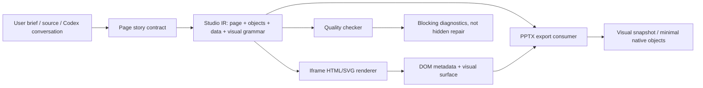

# Studio IR And Contract-First Export Blueprint

Status: living implementation blueprint  
Owner area: Studio generation, iframe HTML, visual grammar, PPTX export  
Primary goal: make generation, iframe rendering, export, and quality consume the same page/object contract

## 1. Thesis

Studio should not try to win by making PPTX export smarter at guessing HTML. The durable path is:

> Codex/user intent creates a page story contract. Studio turns it into a small IR. The iframe renders from that IR and carries object metadata. PPTX export consumes the contract deterministically. Fallback only handles unlabeled leftovers.

This is inspired by PPTD-style systems, but it is not a plan to rebuild a full PowerPoint compiler. The useful idea is the intermediate language, not 177 native shape mappings or complete OOXML authorship.

The target architecture is:



## 2. Why This Exists

Studio currently asks several layers to infer the same thing:

- preflight infers the task and page mission
- page render infers visual structure while writing HTML
- iframe carries the result, often with weak object semantics
- PPTX export reads DOM/SVG geometry and tries to infer chart, table, matrix, text, shape, ownership, and render target

That final step is too late. When export only sees aligned text, dense cards, axes, SVGs, and grids, it can mistake matrix, comparison grid, metric grid, card grid, and chart-like figures for native tables. The symptom is "everything looks like a table." The root cause is that the semantic decision was not carried through the pipeline.

The fix is not only an export contract. The contract must become the shared Studio IR that drives:

- page story and evidence selection
- layout archetype and visual grammar
- iframe object roots and metadata
- export ownership and render target
- deterministic quality checks

## 3. Design Choice: PPTD-Lite, Not Full PPTD

Kimi-style PPTD is a strong reference because it separates:

- AI-written design instructions
- deterministic renderer
- quality checker

We should borrow that separation. We should not copy the whole system.

Do borrow:

- self-contained page descriptions
- object IDs and absolute bounds
- theme tokens
- z-order by object order
- family-specific data contracts
- layout/overflow/ownership checks before delivery

Do not borrow in phase one:

- a full OOXML compiler
- 177 native shape mappings
- public native chart as the default chart path
- model-based export repair after PPTX export
- a second complete presentation runtime beside the iframe

The product already has a browser/iframe authoring surface. That should be the primary visual runtime. PPTX should be a stable delivery artifact, usually through visual snapshots plus a small set of deterministic native objects.

## 4. Non-Goals

Avoid these paths:

- adding more table heuristics to rescue weak HTML
- letting chart/table/matrix detectors override explicit metadata
- making native table the default for any dense grid
- making native chart the public/default chart path
- requiring the page model to re-read the entire source brief on every page
- hiding contract failures behind clean downloads
- using an export issue to automatically trigger a model repair call
- rebuilding an end-to-end PPTX compiler before the iframe contract is stable

Fallback remains allowed, but only for objects that have no semantic label or contract.

## 5. Current State

The current branch has a useful contract-first skeleton:

- `DeckExportContract`, `PageExportContract`, and `ExportObjectContract` exist in shared UI/server types.
- `StudioPreflightPlan` carries `exportContract`.
- preflight can route tasks without an AI preflight stage.
- page render prompts instruct the model to write semantic metadata on visual roots.
- server render validation can detect missing or mismatched object metadata.
- export reads `data-export-object-id`, `data-export-object-kind`, `data-render-target`, `data-ownership-scope`, `data-forbidden-interpretation`, `data-quality-intent`, and `data-export-contract`.
- export can materialize the expected report contract when DOM metadata is missing.
- `chart-visual + visual-snapshot` is the public default chart path.
- public `native-chart/native-chart` contracts are rejected.
- visual chart SVG snapshots must rasterize to PNG or export blocks.
- quality includes export contract counts and violations.

Important limitation:

The contract is still closer to an export aid than a complete Studio IR. Visual variety is still mostly implicit in prompt text and HTML generation instead of being represented as layout grammar.

## 6. Target Studio IR

The Studio IR should be small, hard, and page-scoped. It is not a complete PPTX model.

### 6.1 Deck IR

```ts
type StudioDeckIr = {
  version: 1;
  size: { width: number; height: number };
  theme: StudioThemeContract;
  pages: StudioPageIr[];
};
```

### 6.2 Page IR

```ts
type StudioPageIr = {
  pageNumber: number;
  pageStory: string;
  title?: string;
  evidenceNotes?: string[];
  layoutArchetype: StudioLayoutArchetype;
  visualGrammar: StudioVisualGrammar;
  composition: StudioComposition;
  density: "sparse" | "executive" | "dense";
  objects: StudioObjectIr[];
};
```

### 6.3 Object IR

```ts
type StudioObjectIr = {
  objectId: string;
  pageNumber: number;
  objectKind:
    | "chart-visual"
    | "matrix"
    | "native-table"
    | "comparison-grid"
    | "metric-grid"
    | "card-grid"
    | "diagram"
    | "figure"
    | "text";
  objectRole?: "primary" | "secondary" | "annotation" | "source" | "decoration";
  bounds?: [number, number, number, number];
  slot?: string;
  zIndex?: number;
  dataContract: StudioDataContract | null;
  renderTarget:
    | "visual-snapshot"
    | "editable-shapes"
    | "editable-text"
    | "native-table";
  ownershipScope: {
    rootId: string;
    ownsText: boolean;
    ownsShapes: boolean;
    ownsSvg: boolean;
    childRoles: string[];
  };
  forbiddenInterpretation: string[];
};
```

Rules:

- `native-chart` is not a public/default object kind.
- Charts normally use `objectKind = "chart-visual"` and `renderTarget = "visual-snapshot"`.
- Matrix/comparison/metric/card grids are editable visual objects, not native tables.
- Native table requires true columns and rows.
- Fallback detectors may produce diagnostics, but explicit IR wins.

## 7. Visual Grammar Layer

Avoiding sameness does not require copying 177 PowerPoint shapes. It requires enough high-level layout grammar for the iframe renderer to compose varied pages.

The IR should carry visual intent explicitly:

```ts
type StudioLayoutArchetype =
  | "single-dominant-visual"
  | "hero-metric"
  | "chart-with-insight-rail"
  | "matrix-first"
  | "bubble-landscape"
  | "timeline-led"
  | "process-flow"
  | "swimlane"
  | "benchmark-table"
  | "decision-tree"
  | "layered-stack"
  | "market-map"
  | "portfolio-grid"
  | "capability-model"
  | "funnel"
  | "risk-heatmap"
  | "thesis-evidence-board";

type StudioVisualGrammar =
  | "consulting"
  | "equity-research"
  | "technical-system"
  | "product-strategy"
  | "operating-model"
  | "scientific-figure";

type StudioComposition =
  | "dominant-left-rail-right"
  | "dominant-right-rail-left"
  | "top-title-full-bleed-visual"
  | "center-canvas-annotation-ring"
  | "two-column-contrast"
  | "three-band-narrative"
  | "grid-with-hierarchy";
```

First useful registry:

- hero metric
- chart with insight rail
- matrix / quadrant
- waterfall explanation
- bubble landscape
- timeline
- flywheel
- process flow
- swimlane
- before / after
- benchmark table
- decision tree
- layered stack
- market map
- portfolio grid
- capability model
- operating model
- funnel
- risk heatmap
- thesis + evidence board

The registry should define:

- required slots
- optional slots
- allowed object kinds per slot
- density limits
- default z-order
- export ownership behavior
- anti-patterns, such as equal-weight card walls

This gives variety without making PPTX export a shape encyclopedia.

## 8. Semantic Kind Rules

### Chart Visual

Use for bar, stacked, line, combo, waterfall, bubble, and other chart-like visuals that should look correct in the iframe and export as a stable visual snapshot.

Requirements:

- `objectKind = "chart-visual"`
- `renderTarget = "visual-snapshot"`
- `dataContract` should identify chart family and minimum data fields when available
- native table and native chart must be forbidden unless a future experimental native-chart flag is explicit
- the chart root must snapshot to PNG before PPTX export

Allowed families in the first contract layer:

- `bar`
- `stacked`
- `line`
- `combo`
- `waterfall`
- `bubble`
- `matrix`, but matrix renders to editable shapes, not a PowerPoint chart

### Matrix

Use for 2x2, quadrant, BCG, priority matrix, effort/impact, certainty/importance, and similar spatial decision frames.

Requirements:

- `renderTarget = "editable-shapes"` or `visual-snapshot` when shape extraction is unsafe
- `forbiddenInterpretation` includes `native-table`
- owns text and shapes
- may own SVG if axes or connectors are SVG

Never export a matrix as native table because its two-dimensional layout is semantic space, not rows and columns.

### Native Table

Use only for true row/column data.

Native table is allowed only when one of these is true:

- the DOM uses a real `<table>`
- the root or child carries `data-html-table-spec`
- the object contract says `objectKind = "native-table"` and exposes columns/rows

Do not promote a visual grid into native table just because it is aligned.

### Comparison Grid

Use for option comparisons, trade-off boards, pros/cons, side-by-side competitor or scenario comparison.

Requirements:

- `renderTarget = "editable-shapes"` or `visual-snapshot`
- native table forbidden
- owns text and shapes

Comparison grids may look tabular. They are not native tables unless they have explicit table data.

### Metric Grid

Use for KPI groups, evidence walls, scorecards, numeric fact clusters, dashboard-like stat surfaces.

Requirements:

- `renderTarget = "editable-shapes"` or `visual-snapshot`
- native table forbidden
- owns text and shapes

Metric grids are semantic cards. They are not rows and columns.

### Card Grid

Use for themes, pillars, drivers, modules, buckets, use cases, and repeated explanatory cards.

Requirements:

- `renderTarget = "editable-shapes"` or `visual-snapshot`
- native table forbidden
- owns text and shapes

### Diagram

Use for process flow, swimlane, architecture, timeline, roadmap, system map, scientific figure, and structured concept diagrams.

Requirements:

- `renderTarget = "editable-shapes"` or `visual-snapshot`
- native table forbidden
- native chart forbidden unless an explicit future experimental chart subobject exists
- owns shapes and often SVG

### Text

Use for pages whose primary object is editorial copy, thesis, memo, or narrative.

Requirements:

- `renderTarget = "editable-text"`
- native table and native chart forbidden

## 9. Iframe Metadata Contract

Every contracted object root must carry these attributes:

```html
<figure
  data-export-object-id="p3-primary-matrix"
  data-export-object-kind="matrix"
  data-render-target="editable-shapes"
  data-ownership-scope="text,shape,svg"
  data-forbidden-interpretation="native-table,native-chart"
  data-quality-intent="contract-first-export"
  data-layout-archetype="matrix-first"
  data-visual-grammar="consulting"
  data-export-contract='{"version fields omitted in example"}'
>
  ...
</figure>
```

Rules:

- The root element must wrap the full visual object, not just its title.
- `data-export-object-id` must match the IR.
- `data-export-object-kind` must match `objectKind`.
- `data-render-target` must match `renderTarget`.
- `data-ownership-scope` controls suppression of duplicate text, shapes, and SVG.
- `data-forbidden-interpretation` blocks known wrong interpretations.
- `data-layout-archetype` and `data-visual-grammar` let quality explain why a page became a given structure.
- `data-export-contract` carries the object contract for export and diagnostics.

## 10. Pipeline Responsibilities

### 10.1 Codex Conversation Layer

Purpose:

- compress user intent and source material into a page/story/object contract
- choose layout archetypes and primary visual objects
- identify forbidden interpretations
- keep ambiguous requests from becoming generic card walls

Output:

- optional externally supplied `StudioDeckIr` or `DeckExportContract`
- page-by-page story and object plan

This layer is especially useful when the product is driven through conversation. It can absorb ambiguity before the page model starts writing HTML.

### 10.2 Preflight

Purpose:

- route the task
- call or select skills
- validate or complete the deck/page IR
- keep `page-scoped` pressure low for high/medium confidence tasks

Preflight should remain. It should act as a skill caller and deterministic router.

Preflight should not:

- be the only source of deep semantic planning
- invent detailed chart data that the user/source did not provide
- silently downgrade explicit object contracts
- call a model as a hidden fallback when routing fails

### 10.3 Page Render Model

Purpose:

- generate HTML for one page from the page mission, visual grammar, and object contract
- write semantic metadata into the iframe HTML
- keep the main object aligned to its contract

The model should not:

- relabel a matrix or comparison grid as table because it looks aligned
- omit the contracted root element
- split one contracted object across multiple unrelated roots
- render contract terms such as `objectKind` or `ownershipScope` visibly on the slide

### 10.4 Iframe HTML

Purpose:

- be the primary visual runtime
- carry visual output plus semantic metadata
- make export deterministic

The iframe must become sturdier, but it does not need to be fully rebuilt before IR work starts. The right order is:

1. define a minimal IR skeleton
2. render the main object types from it
3. stamp stable metadata
4. harden layout, snapshot, overflow, and object boundaries

### 10.5 PPTX Export

Purpose:

- read IR/metadata first
- build ownership graph from semantic objects
- render by `renderTarget`
- snapshot `chart-visual` objects to PNG
- apply fallback detectors only to unclaimed, unlabeled DOM
- record contract diagnostics

Export should not:

- override `data-export-object-kind`
- ignore `forbiddenInterpretation`
- promote a forbidden object to native table
- embed SVG `foreignObject` if PNG rasterization fails
- treat fallback detector confidence as higher than explicit metadata
- call the model to repair HTML after export failure

### 10.6 Quality

Purpose:

- verify that contracts were honored
- expose violations clearly
- make dev/test failures actionable

Quality should summarize:

- detected contract count
- missing expected contracts
- object kind distribution
- render target distribution
- forbidden interpretation violations
- visual snapshot/rasterization failures
- duplicate ownership
- repair-risk XML
- unlabeled fallback count

## 11. File Map

Current and expected touchpoints:

- `server/src/lib/studio-engine/contracts.ts`
  - server-side contract and Studio IR types
- `server/src/lib/studio-engine/schemas.ts`
  - API/runtime validation schema
- `server/src/lib/studio-engine/preflight.ts`
  - route, skill activation, contract creation/completion
- `server/src/lib/studio-engine/core.ts`
  - page prompt rules and handoff into page render
- `server/src/lib/studio-engine/render.ts`
  - generated HTML validation and contract metadata diagnostics
- `server/src/lib/studio-engine/page-render-boundary.ts`
  - deterministic page render path and contract handoff
- `ui/src/features/studio/types.ts`
  - client/shared generated report contract types
- `ui/src/features/studio/state.ts`
  - normalize persisted/generated report contract
- `ui/src/features/studio/html-report-data-modules.ts`
  - iframe-side module canonicalization and legacy metadata
- `ui/src/features/studio/pptx/export-pptx.ts`
  - contract-first semantic registry, ownership, snapshot export
- `ui/src/features/studio/pptx/export/quality.ts`
  - contract quality reporting
- `ui/src/features/studio/pptx/export/types.ts`
  - PPTX export diagnostics and quality types
- `ui/src/features/studio/pptx/export/recognition/chart.ts`
  - chart-family contract and unlabeled fallback classification
- future `server/src/lib/studio-engine/visual-grammar.ts`
  - layout archetype registry and slot rules
- future `ui/src/features/studio/visual-grammar/`
  - iframe layout primitives and archetype render helpers

## 12. Implementation Plan

### Phase 0: Baseline Stabilization

Status: mostly done.

Keep:

- deterministic preflight router
- page-scoped workspace
- semantic export contract skeleton
- chart visual snapshot default
- public native-chart rejection
- visual snapshot PNG rasterization guard
- table intent tightening

Do not expand fallback detectors unless a contract-first rule already exists.

Acceptance:

- preflight tests pass
- PPTX export pipeline tests pass
- no new native table promotion for unlabeled dense grids
- public native-chart contract is rejected clearly
- visual chart rasterization failure is fatal

### Phase 1: Studio IR Skeleton

Goal:

Promote the export contract into a small Studio IR shared by preflight, render, iframe, export, and quality.

Work:

- define page-level `layoutArchetype`, `visualGrammar`, `composition`, and `density`
- keep `objects` as the source of export ownership
- validate page/object IDs, render targets, data contracts, and forbidden interpretations
- preserve external user/Codex-supplied contracts

Rules:

- IR must stay page-scoped
- external IR may be completed, but not silently contradicted
- invalid external IR should produce a clear error

Acceptance:

- a request with explicit IR reaches page render prompts
- generated report stores the same IR
- export uses supplied IR even if DOM metadata is missing

### Phase 2: Iframe Metadata Discipline

Goal:

Make the iframe carry stable object roots for the main visual families.

Work:

- require root metadata for all contracted objects
- support primary and secondary objects
- add `data-layout-archetype`, `data-visual-grammar`, and `data-quality-intent`
- prevent overlapping object ownership conflicts

Rules:

- one object may be primary
- secondary objects must still have stable IDs
- footer/source text can be `editable-text` with narrow ownership

Acceptance:

- export reads multiple objects on one page
- duplicate ownership diagnostics catch overlap
- secondary table does not cause primary matrix to become table

### Phase 3: Visual Grammar Registry

Goal:

Prevent sameness by giving the iframe a controlled set of strong layout archetypes.

Work:

- create a first registry of 20-30 layout archetypes
- define required slots, optional slots, allowed object kinds, density limits, and anti-patterns
- map task routes and page stories to archetypes
- make page prompts refer to archetype slots instead of vague "make it premium" language

Rules:

- visual grammar is high-level; it does not become a PPTX shape encyclopedia
- every archetype must explain export ownership and snapshot boundaries
- a page should normally have one dominant visual thesis

Acceptance:

- Tencent/source-backed cases do not collapse into repeated card walls
- chart, matrix, flow, and table pages choose different archetypes
- quality can report which archetype each page used

### Phase 4: Export As Deterministic Consumer

Goal:

Make PPTX export execute IR and metadata instead of interpreting visual structure.

Work:

- render `chart-visual` as PNG snapshot
- render `native-table` only from true rows/columns
- render matrix/comparison/metric/card/diagram as editable shapes or snapshot according to target
- block fallback inside semantic object roots
- keep unlabeled fallback visible in quality

Rules:

- no model repair after export failure
- no `foreignObject` SVG fallback in PPTX
- no native chart unless a future experimental path is explicit and package validation agrees

Acceptance:

- export never lets fallback detectors override semantic metadata
- forbidden native-table interpretation is blocked
- chart snapshot failures are fatal and visible

### Phase 5: Iframe Visual Hardening

Goal:

Make the browser output stable enough to be the source of truth.

Work:

- stabilize object bounds and roots
- make SVG/chart snapshot regions explicit
- reduce layout dependence on unpredictable flowing content
- add overflow and clipping checks
- ensure each page can be snapshotted deterministically

Acceptance:

- main object roots are not empty
- snapshot regions produce nonblank PNGs
- chart/table/matrix root bounds are stable across render/review/export
- source notes and annotations do not leak into primary visual ownership

### Phase 6: Deterministic Quality Gates

Goal:

Make contract failure visible and blocking where appropriate.

Hard failures in dev/test:

- visual chart snapshot missing or rasterization failed
- promised native table but no rows/columns
- matrix/comparison-grid/card-grid exported as native table
- duplicate object IDs
- forbidden interpretation violated
- repair-risk PPTX XML
- blank/transparent slide output

Soft warnings:

- expected contract materialized from report because DOM metadata was missing
- unlabeled object used fallback detector
- object root too broad, such as entire page root

Acceptance:

- quality report can explain every contract failure
- golden tests include contract diagnostics
- export UI can surface concise contract warnings

### Phase 7: Reduce Legacy Guessing

Goal:

Keep fallback but make it smaller and safer.

Work:

- label each fallback path as `unlabeled-fallback`
- block fallback inside any semantic object root
- require explicit table intent for div/grid pseudo tables
- keep chart SVG/DOM fallback only for high-confidence complete data

Acceptance:

- fallback detectors cannot override metadata
- unlabeled fallback count is visible in quality
- old fixtures still export when no contract exists

### Phase 8: Optional Native Objects

Goal:

Add native PowerPoint support only when it is cheaper and safer than snapshot.

Candidates:

- native table from explicit rows/columns
- editable text
- simple editable shapes

Deferred:

- public native chart
- native chart style XML patching
- broad shape-family replication

Acceptance:

- any native object path has package validation coverage
- public schema and package validation agree
- unsupported native paths fail before export, not inside the PPTX package

## 13. Contract Examples

### 13.1 Chart Visual Page

```json
{
  "pageNumber": 2,
  "pageStory": "Tencent's AI advantage compounds where engagement and monetization already coexist.",
  "layoutArchetype": "chart-with-insight-rail",
  "visualGrammar": "equity-research",
  "composition": "dominant-left-rail-right",
  "density": "executive",
  "objects": [
    {
      "objectId": "p2-primary-chart",
      "objectKind": "chart-visual",
      "objectRole": "primary",
      "slot": "dominant-visual",
      "dataContract": {
        "type": "chart-bubble",
        "points": [
          { "label": "WeChat", "x": 88, "y": 82, "size": 90, "color": "#2f6fed" },
          { "label": "Games", "x": 72, "y": 66, "size": 74, "color": "#12a182" }
        ]
      },
      "renderTarget": "visual-snapshot",
      "ownershipScope": {
        "rootId": "p2-primary-chart",
        "ownsText": true,
        "ownsShapes": true,
        "ownsSvg": true,
        "childRoles": ["plot", "axis", "label", "legend", "annotation"]
      },
      "forbiddenInterpretation": ["native-table", "native-chart"]
    }
  ]
}
```

### 13.2 Matrix Page

```json
{
  "objectId": "p3-primary-matrix",
  "pageNumber": 3,
  "pageStory": "Tencent's AI upside is strongest where traffic ownership and monetization depth compound.",
  "objectKind": "matrix",
  "dataContract": {
    "type": "matrix",
    "xAxis": "Monetization depth",
    "yAxis": "Traffic ownership",
    "items": [
      { "label": "WeChat", "x": 0.82, "y": 0.88 },
      { "label": "Games", "x": 0.76, "y": 0.62 },
      { "label": "Ads", "x": 0.58, "y": 0.72 }
    ]
  },
  "renderTarget": "editable-shapes",
  "ownershipScope": {
    "rootId": "p3-primary-matrix",
    "ownsText": true,
    "ownsShapes": true,
    "ownsSvg": true,
    "childRoles": ["axis", "quadrant", "item", "annotation"]
  },
  "forbiddenInterpretation": ["native-table", "native-chart"]
}
```

### 13.3 Native Table Page

```json
{
  "objectId": "p4-primary-native-table",
  "pageNumber": 4,
  "pageStory": "The operating comparison needs exact rows and columns.",
  "objectKind": "native-table",
  "dataContract": {
    "type": "table",
    "columns": ["Workstream", "Baseline", "Current", "Delta"],
    "rows": [
      ["Intake handoff", "42m", "34m", "-8m"],
      ["Referral release", "61m", "58m", "-3m"]
    ]
  },
  "renderTarget": "native-table",
  "ownershipScope": {
    "rootId": "p4-primary-native-table",
    "ownsText": false,
    "ownsShapes": false,
    "ownsSvg": false,
    "childRoles": ["table", "row", "column", "cell"]
  },
  "forbiddenInterpretation": []
}
```

## 14. Prompt Contract For Page Render

Each page render prompt should include a compact block like this:

```text
Page IR:
- pageStory: Tencent's AI advantage compounds where engagement and monetization coexist.
- layoutArchetype: chart-with-insight-rail
- visualGrammar: equity-research
- composition: dominant-left-rail-right
- density: executive

Primary object:
- objectId: p2-primary-chart
- objectKind: chart-visual
- renderTarget: visual-snapshot
- ownershipScope: text,shape,svg
- forbiddenInterpretation: native-table,native-chart
- slot: dominant-visual

The root element of the primary visual object must include:
- data-export-object-id="p2-primary-chart"
- data-export-object-kind="chart-visual"
- data-render-target="visual-snapshot"
- data-ownership-scope="text,shape,svg"
- data-forbidden-interpretation="native-table,native-chart"
- data-layout-archetype="chart-with-insight-rail"
- data-visual-grammar="equity-research"
- data-quality-intent="contract-first-export"
- data-export-contract='...'

Do not label comparison-grid, metric-grid, card-grid, matrix, diagram, or text objects as native tables just because their content aligns in rows or columns.
```

For multi-object pages, repeat the object block per object.

## 15. Export Decision Order

Export must use this order:

1. Read report-level expected IR/contract.
2. Read DOM object metadata.
3. Merge expected and rendered contract.
4. Build semantic ownership graph.
5. Render explicit objects by `renderTarget`.
6. Snapshot explicit `chart-visual` objects to PNG.
7. Render explicit native tables only from rows/columns.
8. Run fallback detectors only on unclaimed, unlabeled DOM.
9. Apply deterministic package validation/patching.
10. Run quality contract diagnostics.

Never reverse steps 4 and 8.

## 16. Table Safety Policy

Native table is the most dangerous false positive.

Hard rules:

- real `<table>` can become native table
- `data-html-table-spec` can become native table
- `objectKind = "native-table"` can become native table only with rows/columns
- `comparison-grid`, `metric-grid`, `card-grid`, `matrix`, `diagram`, `chart-visual`, and `text` must not become native table
- div/grid pseudo table fallback requires explicit table intent

Explicit table intent may come from:

- `data-export-role="table"`
- `data-export-object-kind="native-table"`
- `data-html-module-kind="table"`
- `data-html-table-spec`
- real `<table>`

The word "grid" alone is not enough unless it appears as a semantic role with table intent.

## 17. Test Plan

### Unit Tests

Server:

- explicit external Studio IR passes schema
- preflight preserves external IR
- preflight completes missing safe defaults without contradicting explicit fields
- page render prompt includes visual grammar and object metadata rules
- public native-chart contract is rejected clearly
- ambiguous briefs route without hidden AI fallback

UI/export:

- semantic registry reads DOM metadata
- report contract materializes when DOM metadata is missing
- forbidden native-table blocks table collection
- multiple object contracts produce distinct owners
- unlabeled fallback does not enter semantic object roots
- chart visual snapshot rasterization failure is fatal

### Golden / Browser Tests

Add or extend:

- Tencent source-backed case
- matrix beside real table
- comparison grid that looks table-like but forbids native table
- metric grid with aligned numbers
- card grid with repeated cells
- native table with explicit rows/columns
- chart visual snapshot case
- bubble chart visual case
- missing metadata quality case

### Verification Commands

Use targeted tests while developing:

```bash
corepack pnpm --dir server exec tsx src/lib/studio-engine/preflight.test.ts
corepack pnpm --dir ui exec tsx src/features/studio/pptx-export-pipeline.test.ts
corepack pnpm --dir ui exec tsx src/features/studio/generation.test.ts
```

Before merging:

```bash
corepack pnpm --dir server typecheck
corepack pnpm --dir ui typecheck
corepack pnpm test:pptx:golden
git diff --check
```

## 18. Definition Of Done

The Studio IR/export architecture is considered complete when:

- generation requests can carry explicit page/object IR
- preflight can validate, complete, and preserve that IR
- page render writes semantic metadata for all contracted objects
- iframe objects have stable roots and snapshot boundaries
- layout archetypes produce varied, non-card-wall pages
- export never lets fallback detectors override semantic metadata
- chart visuals export as nonblank PNG snapshots
- native table requires explicit table intent and table data
- matrix/comparison-grid/metric-grid/card-grid false table exports are blocked
- quality report explains contract compliance and violations
- golden/browser fixtures cover explicit contracts and unlabeled fallback

## 19. Drift Warnings

If a future change does any of these, it is probably moving away from this blueprint:

- adds a new native table heuristic without checking semantic contracts
- makes export infer semantic kind inside a labeled object
- treats fallback detector output as authoritative
- expands page render prompt without adding object metadata
- hides metadata diagnostics instead of surfacing them in quality
- makes preflight drop an externally supplied contract
- adds chart/table support without a family-specific data contract
- reintroduces public/default native chart while package validation rejects chart XML
- reintroduces SVG `foreignObject` fallback into PPTX
- uses model repair as the default response to export quality failures

## 20. Short Operating Rule

When in doubt:

> Studio IR is the source of truth. The iframe renders it and carries it. Export executes it. Quality explains violations. Fallback only handles unlabeled leftovers.
